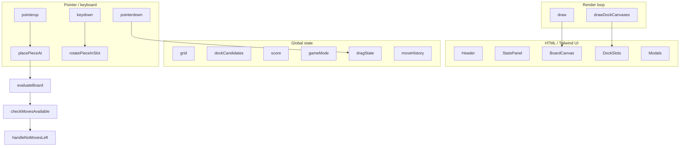

# Cyber Block Puzzle — Code Documentation

A single-file browser game (`index.html`, ~1,270 lines). Vanilla HTML/CSS/JS, Canvas 2D, Tailwind CDN, Lucide icons, Web Audio API synth. No build step.

## Quick start

```bash
cd blocks
python3 -m http.server 8080
# open http://localhost:8080/index.html
```

Regenerate `index.html` from RTF on macOS:

```bash
textutil -convert txt -output index.html blocks.rtf
```

## File layout

```
blocks/
├── index.html    # entire app (markup + styles + script)
├── blocks.rtf    # original RTF-wrapped source
└── README.md
```

The `<script>` block (~line 254–1268) contains all game logic. Everything else is HTML structure and Tailwind classes.

---

## Architecture overview



**Pattern:** procedural JS with module-level `let` state. No classes except `SoundEngine` and `Particle`. DOM is updated imperatively via `getElementById`.

---

## Constants & config

| Symbol | Value | Location |
|--------|-------|----------|
| `gridCols` / `gridRows` | 10 | Board size |
| `dockCandidates` | length 3 | Pieces in hand |
| `blockSize` | dynamic | `canvas.width / gridCols` |
| `shapeTemplates` | 14 shapes | Polyomino matrices + color keys |
| `blockColors` | 7 named colors | Maps color key → hex |
| `localStorage` key | `block_puzzle_cyber_best` | High score |
| Zen history cap | 20 snapshots | `moveHistory.shift()` |
| Tap threshold | `< 240ms` and `< 12px` | Tap vs drag |
| Touch Y offset | `-55px` | Finger placement lift |

### Shape templates (`shapeTemplates`)

Each entry: `{ matrix: number[][], color: string }` where `1` = filled cell.

| # | Shape | Color |
|---|-------|-------|
| 1 | 1×1 | green |
| 2 | 1×2 | cyan |
| 3 | 1×3 | cyan |
| 4 | 1×4 | cyan |
| 5 | 2×1 vertical | blue |
| 6 | 3×1 vertical | blue |
| 7 | 2×2 | yellow |
| 8 | 3×3 | purple |
| 9 | Corner L | orange |
| 10 | T | pink |
| 11 | Z | green |
| 12 | S | orange |
| 13 | J | blue |
| 14 | L | pink |

---

## Global state

```js
let grid                    // (string|null)[][]  — color key per cell, null = empty
let dockCandidates          // (Piece|null)[3]
let score, clearedLines, highscore
let isGameOver, isPaused
let gameMode                // 'arcade' | 'zen'
let pendingModeSelection    // mode target during restart confirm
let particles               // Particle[]
let screenShakeTime         // frames of shake remaining
let moveHistory             // Zen snapshots[]
let dragState               // active drag tracking
```

### `dragState`

```js
{
  active: boolean,
  slotIndex: number,      // 0–2
  pointerId: number,
  startX, startY,
  currentX, currentY,
  isTouch: boolean,
  touchStartTime: number
}
```

### Zen snapshot (`saveSnapshot`)

```js
{
  grid: string,           // JSON.stringify(grid)
  dockCandidates: string,
  score: number,
  clearedLines: number
}
```

---

## Classes

### `SoundEngine` (line ~254)

Singleton: `const SFX = new SoundEngine()`.

| Method | Trigger |
|--------|---------|
| `init()` | First user gesture; creates `AudioContext` |
| `toggle()` | Audio on/off; resumes suspended context |
| `playGrab()` | Pointer down on dock piece |
| `playPlace()` | Successful placement |
| `playRotate()` | Rotation / undo |
| `playClear(n)` | Line clear (chord arpeggio, up to 5 osc) |
| `playGameOver()` | Arcade loss |
| `startZenDrone()` | Zen mode ambient (E2 triangle, 3s fade-in) |
| `stopZenDrone()` | Pause or leave Zen |

### `Particle` (line ~499)

Burst effect on line clears and Zen healing. Updated/drawn inside `draw()` loop; removed when `alpha <= 0`.

---

## Core functions

### Board logic

| Function | Purpose |
|----------|---------|
| `canPlacePieceAt(matrix, startCol, startRow)` | Bounds + collision check against `grid` |
| `placePieceAt(matrix, startCol, startRow, color)` | Writes cells, `+10` per tile, plays place SFX |
| `evaluateBoard()` | Finds full rows/cols, clears them, combo score, particles, shake |
| `checkMovesAvailable()` | Brute-force: any dock piece fits anywhere? |
| `handleNoMovesLeft()` | Arcade → `triggerGameOver()`; Zen → clear inner 6×6 (rows/cols 2–7) |

### Dock & pieces

| Function | Purpose |
|----------|---------|
| `getRandomPiece()` | Deep-clone random `shapeTemplates` entry |
| `refillDock()` | Fill all 3 slots with new pieces |
| `checkDockEmpty()` | All slots `null` → refill |
| `rotatePieceInSlot(idx)` | 90° CW matrix rotation |

### Zen mode

| Function | Purpose |
|----------|---------|
| `saveSnapshot()` | Push state before move (Zen only, max 20) |
| `restoreSnapshot()` | Pop and restore grid/dock/score |
| `updateUndoButtonState()` | Enable/disable `#btn-undo` |

### Rendering

| Function | Purpose |
|----------|---------|
| `resizeCanvas()` | Fit board to viewport (220–410px); mobile vs desktop formulas |
| `drawBoardGrid()` | Grid lines on main canvas |
| `drawBoardBlock(c, r, color, isPreview)` | Single cell with gradient + glow |
| `draw()` | Main loop via `requestAnimationFrame`: shake, grid, placed blocks, drag ghost, particles |
| `drawDockCanvases()` | Renders 3 dock preview canvases |

### UI & game flow

| Function | Purpose |
|----------|---------|
| `showToast(title, subtitle)` | 1.2s combo/heal banner |
| `updateStatsUI()` | Score, cleared lines, high score (zero-padded) |
| `triggerGameOver()` | Set flag, modal, game-over SFX |
| `startNewGame(mode)` | Reset state, mode UI, refill dock |
| `togglePause()` | Pause overlay + zen drone stop/start |
| `showRestartConfirmation(targetMode)` | Pause + confirm if score > 0 |
| `hideRestartConfirmation()` | Dismiss overlay, unpause |

---

## Turn flow (placement)

```
pointerdown on .dock-slot
  → saveSnapshot()          // Zen only
  → hide dock canvas opacity
  → SFX.playGrab()

pointerup
  → if tap (< 240ms, < 12px): rotatePieceInSlot(); pop snapshot if Zen
  → else if valid grid position:
       placePieceAt()
       dockCandidates[idx] = null
       evaluateBoard()
       if checkDockEmpty(): refillDock()
       if !checkMovesAvailable(): handleNoMovesLeft()
     else if Zen: moveHistory.pop()
  → reset dragState, drawDockCanvases()
```

### Grid coordinate mapping

```js
gCol = Math.round((localX / blockSize) - mW / 2)
gRow = Math.round((targetY / blockSize) - mH / 2)
// targetY = localY - 55 on touch
```

Screen coords → canvas pixels via `getBoundingClientRect()` scale factor.

### Scoring

```js
// On place
score += tileCount * 10

// On clear (evaluateBoard)
comboPoints = totalLines * 150 * totalLines
score += comboPoints
clearedLines += totalLines
```

High score written to `localStorage` when `score > highscore` after a clear.

---

## DOM element reference

### Canvases

| ID | Role |
|----|------|
| `canvas-board` | Main 10×10 board |
| `dock-canvas-0` … `dock-canvas-2` | Dock previews |

### Stats & HUD

| ID | Role |
|----|------|
| `score-val` | Current score |
| `lines-val` | Cleared line count |
| `highscore-val` | Best score |
| `zen-panel` | Undo panel (disabled in Arcade) |
| `toast-banner` | Combo/heal toast |

### Buttons

| ID | Action |
|----|--------|
| `btn-audio` | Toggle SFX |
| `btn-pause` / `btn-resume` | Pause toggle |
| `btn-restart` | Restart confirm |
| `btn-help` / `btn-close-help` | Help overlay |
| `btn-undo` | Zen undo |
| `mode-arcade` / `mode-zen` | Mode switch |
| `btn-modal-action` | Start Arcade |
| `btn-modal-zen-action` | Start Zen |
| `btn-restart-confirm` / `btn-restart-cancel` | Restart dialog |

### Overlays

| ID | Role |
|----|------|
| `modal-overlay` | Start / game over |
| `pause-overlay` | Paused state |
| `restart-overlay` | Restart confirmation |
| `help-overlay` | Rules |

### Dock markup

- Container: `#dock-slots`
- Each slot: `.dock-slot[data-slot="0|1|2"]`
- Rotate: `.btn-rotate-slot[data-slot="…"]`

---

## Input handling

| Event | Target | Behavior |
|-------|--------|----------|
| `pointerdown` | `#dock-slots` | Start drag (ignores `.btn-rotate-slot`) |
| `pointerdown` | `.btn-rotate-slot` | Rotate only (`stopPropagation`) |
| `pointermove` | `window` | Update `dragState.currentX/Y` |
| `pointerup` | `window` | Place, rotate (tap), or cancel |
| `pointercancel` | `window` | Reset drag visuals |
| `keydown` | `window` | `R` / `Space` / `↑` rotate while dragging |
| `touchmove` | `body` | `preventDefault` when dragging (no scroll) |
| `resize` | `window` | `resizeCanvas()` |

---

## Render loop

```js
function draw() {
  // screen shake offset
  // clear canvas
  // drawBoardGrid()
  // draw placed blocks from grid[][]
  // if dragging: ghost preview on board + floating piece at cursor
  // update/draw particles
  requestAnimationFrame(draw);
}

// Boot (end of script)
lucide.createIcons();
resizeCanvas();
requestAnimationFrame(draw);
```

`draw()` runs continuously; game state changes trigger visual updates on the next frame.

---

## External dependencies (CDN)

| Resource | URL |
|----------|-----|
| Tailwind | `https://cdn.tailwindcss.com` |
| Lucide | `https://unpkg.com/lucide@latest` |
| Fonts | Google Fonts — Orbitron, Rajdhani |

Tailwind theme extensions (`cyberBg`, `neonCyan`, etc.) are set inline in `<head>`.

---

## Suggested refactor (if splitting later)

```
src/
├── config/shapes.js      # shapeTemplates, blockColors, constants
├── audio/SoundEngine.js
├── game/Board.js         # canPlace, place, evaluate, checkMoves
├── game/Dock.js          # refill, rotate, getRandomPiece
├── game/ZenMode.js       # snapshots
├── render/Canvas.js      # draw, drawDock, resize
├── input/Drag.js         # pointer handlers
└── ui/UI.js              # modals, stats, toasts
```

Keep behavior identical; extract pure functions first, then wire from `main.js`.

---

## License

Not specified.
